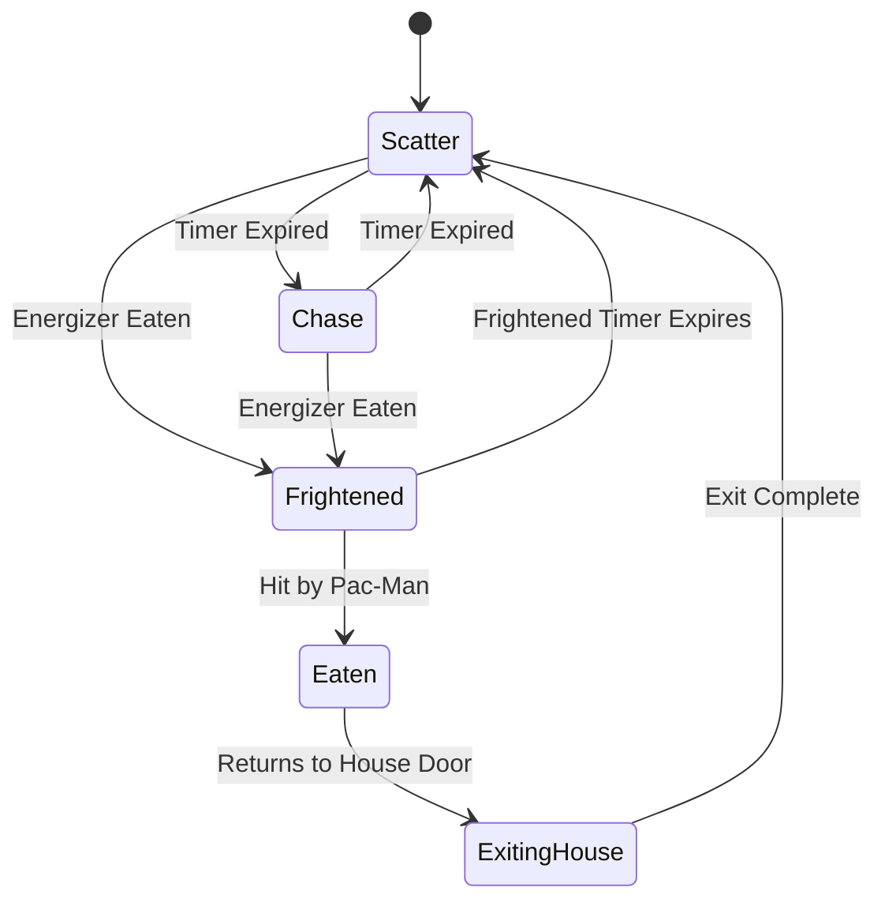

# 🕹️ Pac-Man Retro Arcade

An arcade-accurate, pixel-perfect clone of the original **1980 Pac-Man arcade game** written in **C#** utilizing the **MonoGame** framework. This project stands out by procedurally generating retro sprites and synthesizing retro arcade audio directly in RAM at startup—eliminating external heavy assets and replicating the exact logic, timings, state machines, and bugs of the original cabinet.

---

## 👻 Key Mechanics & Authentic AI

This clone is built from the ground up to reproduce the deep, non-obvious details of the 1980 arcade logic.



### 1. Unique Ghost Personalities (Arcade Targeting)
Each ghost does not simply chase Pac-Man. They evaluate a **target tile** relative to Pac-Man on every tile intersection and choose the direction that yields the shortest Euclidean distance to that tile.
*   🔴 **Blinky (Red / Shadow)**: Direct chaser. Targets Pac-Man's exact current tile.
    *   *Cruise Elroy Mechanic*: When the dots left in the maze drop below specific thresholds (e.g., 20 dots, then 10 dots), Blinky speeds up and will target Pac-Man's tile even when the rest of the ghosts are in Scatter mode.
*   🌸 **Pinky (Pink / Speedy)**: Ambusher. Targets **4 tiles ahead** of Pac-Man's current facing direction.
    *   *The Up-Offset Bug*: Replicating the original assembly code bug: if Pac-Man is facing **UP**, Pinky targets 4 tiles Up **and** 4 tiles Left (vector `[-4, -4]`).
*   🔵 **Inky (Cyan / Bashful)**: Flanker. Targets a tile determined by drawing a vector from Blinky's current position to a tile **2 spaces ahead** of Pac-Man, and then **doubling** that vector.
*   🟠 **Clyde (Orange / Pokey)**: Indecisive. Targets Pac-Man directly if Clyde is **more than 8 tiles away**. If Clyde is closer than 8 tiles, he switches target coordinates to his scatter corner (bottom-left).

### 2. Forbidden Upward Turns
In Chase or Scatter mode, ghosts are strictly forbidden from turning **UP** at four key intersections (directly above the ghost house gate and Pac-Man's starting area):
*   `(12, 14)` & `(15, 14)` (top T-junctions)
*   `(12, 26)` & `(15, 26)` (bottom T-junctions)

This restriction is lifted when ghosts are in **Frightened** (blue) or **Eaten** (eyes returning to base) modes, matching the original cabinet.

### 3. Ghost House Release System
Ghosts are released sequentially using a complex state machine driven by dot counters and inactivity timers:

```mermaid
graph TD
    A[Start Level or Life Reset] --> B{Global Counter Active?}
    B -- No (Start of Level) --> C[Check Individual Dot Limits]
    B -- Yes (After Death Reset) --> D[Check Global Dot Counter]
    
    C --> C1[Pinky: 0 dots]
    C --> C2[Inky: 30 dots (Lvl 1)]
    C --> C3[Clyde: 60 dots (Lvl 1)]
    
    D --> D1[Pinky: 7 dots]
    D --> D2[Inky: 17 dots]
    D --> D3[Clyde: 32 dots]
    
    D3 --> D4[Deactivate Global Counter]
    
    A --> E[Failsafe Inactivity Timer]
    E --> F{4.0s / 3.0s Idle?}
    F -- Yes --> G[Release Next Ghost]
```
*   **Individual Counters**: Active at level start. Pinky exits immediately (limit 0), Inky at 30 dots, Clyde at 60 dots. (Thresholds scale down on higher levels).
*   **Global Counter**: Active after a life is lost. Pinky exits at 7 global dots, Inky at 17, and Clyde at 32. Eating dots resets the timer. The global system deactivates once Clyde exits or if Clyde is already outside.
*   **Failsafe Release Timer**: If Pac-Man stops eating dots, an auxiliary timer releases the next ghost in line after **4.0 seconds** of inactivity (**3.0 seconds** on Level 5+).

### 4. Tunnel Wrap-Around
Located on row 17. Utilizes mathematical modulo wrap-around `x = (x % Width + Width) % Width;` to allow smooth lookahead targeting calculations and coordinate wrapping without indexing errors.

---

## 🛠️ Procedural Synthesis & Dynamic Assets

One of the project's highlights is the **absence of heavy asset folders** (no bulky audio or image packs).

### 🎨 Pixel-Perfect Sprite Generation
While most Pac-Man clones load pre-sliced sprite sheets, this project extracts base visual states from a compact `spritesheet.png` and generates structural sprites dynamically:
*   **Pac-Man**: Formulates his circular frame variations (Closed, Partial, Open) dynamically across all four directions.
*   **Death Animation**: Procedurally runs a 3-stage death sequence including a **1.0s Freeze Phase**, a **1.2s Dissolve Phase** (11-frame shrinking mouth animation), and a **0.4s Invisible Phase** before screen reset.
*   **Retro Scaled View**: Renders to a virtual low-res **224x288** screen. Uses `SamplerState.PointClamp` scaling to match modern monitors without blurry pixels.

### 🔊 Sound Wave Synthesis
Sound effects are built in raw byte buffers in RAM at runtime using sine/square wave equations, then wrapped with standard WAV headers dynamically to be fed into MonoGame's `SoundEffect.FromStream`:
*   **Waka-Waka**: Rapid frequency sweeps sliding between 300Hz and 650Hz.
*   **Start Theme**: Full 4-measure intro sequence using precise musical notes (e.g., B4, B5, F#5, D#5) driven by a BPM scale.
*   **Death Sound**: 12 cascading pitch sweeps sliding down from 850Hz to 200Hz, ending with a white-noise decay.
*   **Looping Sirens**: Ambient sirens that scale in pitch and speed as dots are eaten.

---

## 📂 Project Structure

```
├── Game/
│   ├── Program.cs          # Application entry point
│   ├── Game1.cs            # Core loop, game state manager, collisions, HUD & release handlers
│   ├── Pacman.cs           # Pac-Man coordinate tracking, tile alignment, steering & lives
│   ├── Ghost.cs            # Ghost targeting algorithms, pathfinding lookahead, & state machine
│   ├── ClassicMaze.cs      # Layout grid, wrap-around logic, wall checks, pellet coordinates
│   ├── TextureGenerator.cs # Procedural cropping and drawing of sprite textures in RAM
│   ├── SoundSynth.cs       # Custom 8-bit audio waveform synthesis and memory stream buffers
│   ├── TextRenderer.cs     # Pixel font HUD drawer (Ready!, Game Over, Score, High Score)
│   └── GameState.cs        # Enumeration of active states (Menu, Ready, Playing, Caught, Over)
├── Content/                # Spritesheet and base font assets
└── pac-man.csproj          # C# project and package configuration
```

---

## ⌨️ Controls

| Key | Action |
| :--- | :--- |
| **Arrow Keys / WASD** | Move Pac-Man |
| **Enter** | Start Game (from Menu) / Restart (on Game Over) |
| **Escape** | Exit Game |

---

## 🚀 Getting Started

### Prerequisites
*   [.NET SDK 8.0](https://dotnet.microsoft.com/download) or higher.

### Installation & Run
1. Clone this repository.
2. Navigate to the project directory:
   ```bash
   cd pac-man
   ```
3. Run the project:
   ```bash
   dotnet run
   ```
